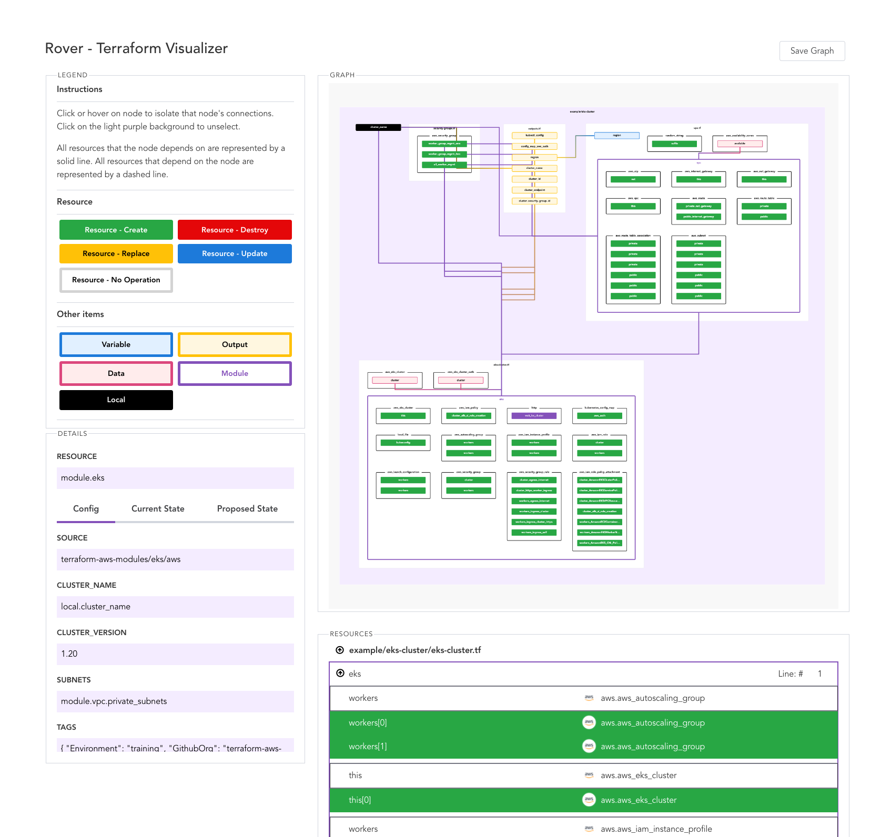

## Rover - Terraform Visualizer

Rover is a [Terraform](http://terraform.io/) visualizer. 

In order to do this, Rover:

1. generates a [`plan`](https://www.terraform.io/docs/cli/commands/plan.html#out-filename) file and parses the configuration in the root directory.
1. parses the `plan` and configuration files to generate three items: the resource overview (`rso`), the resource map (`map`), and the resource graph (`graph`).
1. consumes the `rso`, `map`, and `graph` to generate an interactive configuration and state visualization hosts on `localhost:9000`.

Feedback (via issues) and pull requests are appreciated! 



## Installation

You can download Rover binary specific to your system by visiting the [Releases page](https://github.com/im2nguyen/rover/releases). Download the binary, unzip, then move `rover` into your `PATH`.

- [rover zip — MacOS](https://github.com/im2nguyen/rover/releases/download/v0.1.0/rover_0.1.0_darwin_amd64.zip)
- [rover zip — Windows](https://github.com/im2nguyen/rover/releases/download/v0.1.0/rover_0.1.0_windows_amd64.zip)

### Build from source

You can build Rover manually by cloning this repository, then building the frontend and compiling the binary. It requires Go v1.16+ and `npm`.

#### Build frontend

First, navigate to the `ui`.

```
$ cd ui
```

Then, install the dependencies.

```
$ npm install
```

Finally, build the frontend.

```
$ npm run build
```

#### Compile binary

Navigate to the root directory.

```
$ cd ..
```

Compile and install the binary. Alternatively, you can use `go build` and move the binary into your `PATH`.

```
$ go install
```

## Basic usage

This repository contains two example Terraform configurations in `example`.

Navigate into `random-test` example configuration. This directory contains configuration that showcases a wide variety of features common in Terraform (modules, count, output, locals, etc) with the [`random`](https://registry.terraform.io/providers/hashicorp/random/latest) provider.

```
$ cd example/random-test
```

Run Rover. Rover will start running in the current directory and assume the Terraform binary lives in `/usr/local/bin/terraform` by default.

```
$ rover
2021/06/23 22:51:27 Starting Rover...
2021/06/23 22:51:27 Initializing Terraform...
2021/06/23 22:51:28 Generating plan...
2021/06/23 22:51:28 Parsing configuration...
2021/06/23 22:51:28 Generating resource overview...
2021/06/23 22:51:28 Generating resource map...
2021/06/23 22:51:28 Generating resource graph...
2021/06/23 22:51:28 Done generating assets.
2021/06/23 22:51:28 Rover is running on localhost:9000
```

You can specify the working directory (where your configuration is living) and the Terraform binary location using flags.

```
$ rover -workingDir "example/eks-cluster" -tfPath "/Users/dos/terraform"
```

Once Rover runs on `localhost:9000`, navigate to it to find the visualization!
